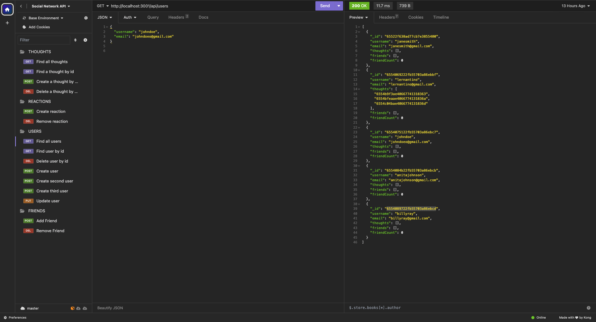

## Social Network API

## Description

The purpose of this project is to create an API for a web-based social network application where users can share their thoughts, react to friends' thoughts, and create a friend list. This application uses `Express.js` for routing, a `MongoDB` database, and a `Mongoose` ODM. Additionally, it uses `Day.js`` to format timestamps. `Insomnia` was used to create seed data for this application.

- This application solves the issues of speed and flexibility since it uses MongoDB. MongoDB is a top pick for many social networks due to its speed with large data sets and its flexibility with unstructured data.

## Table of Contents

If your README is long, add a table of contents to make it easy for users to find what they need.

- [Installation](#installation)
- [Usage](#usage)
- [Credits](#credits)
- [License](#license)

## Installation

1. Install Node.js onto your computer
2. Open VS Code or a different code editor
3. Establish a MongoDB account
4. Install MongoDB Compass
5. npm install day.js
6. npm install dotenv
7. npm install express
8. npm install mongoose
9. npm install node 
10. npm install nodemon

## Usage

Link to video recording: 

1. Right click on the server.js, open in integrated terminal
2. enter npm i to install node_modules
3. npm run start or dev
4. Test routes for CRUD functionality in Insomnia

## Credits

https://www.markdownguide.org/cheat-sheet/

https://gist.github.com/lukas-h/2a5d00690736b4c3a7ba

https://coding-boot-camp.github.io/full-stack/github/professional-readme-guide

## MIT License

Copyright (c) 2023 G6-2Flyy

Permission is hereby granted, free of charge, to any person obtaining a copy of this software and associated documentation files (the "Software"), to deal in the Software without restriction, including without limitation the rights to use, copy, modify, merge, publish, distribute, sublicense, and/or sell copies of the Software, and to permit persons to whom the Software is furnished to do so, subject to the following conditions:

The above copyright notice and this permission notice shall be included in all copies or substantial portions of the Software.

THE SOFTWARE IS PROVIDED "AS IS", WITHOUT WARRANTY OF ANY KIND, EXPRESS OR IMPLIED, INCLUDING BUT NOT LIMITED TO THE WARRANTIES OF MERCHANTABILITY, FITNESS FOR A PARTICULAR PURPOSE AND NONINFRINGEMENT. IN NO EVENT SHALL THE AUTHORS OR COPYRIGHT HOLDERS BE LIABLE FOR ANY CLAIM, DAMAGES OR OTHER LIABILITY, WHETHER IN AN ACTION OF CONTRACT, TORT OR OTHERWISE, ARISING FROM, OUT OF OR IN CONNECTION WITH THE SOFTWARE OR THE USE OR OTHER DEALINGS IN THE SOFTWARE.

